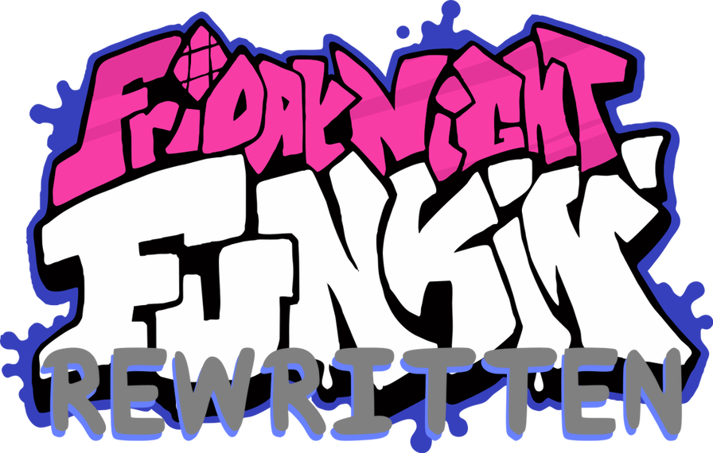

# 
     

Friday Night Funkin' Rewritten is a rewrite of [Friday Night Funkin'](https://ninja-muffin24.itch.io/funkin) built on [LÖVE](https://love2d.org/) and [LÖVE Potion](https://github.com/lovebrew/LovePotion) for Windows, macOS, and Linux, as well as previously unsupported platforms, like the Nintendo Switch!

Friday Night Funkin' Rewritten features:
* A rewritten engine focused on performance and playability
* Much less memory usage than the original game
* Controller support
* Other cool features, like downscroll
* And more to come!

Join the Discord server for updates: https://discord.gg/tQGzN2Wu48

# Controls
If using a controller on a PC, a controller with an Xbox button layout is recommended. Controller buttons will be remappable in a future update.

## Menus
### Keyboard
* Arrow Keys - Select
* Enter - Confirm
* Escape - Back

### Controller
* Left Stick/D-Pad - Select
* A - Confirm
* B - Back

## Game
### Keyboard
* WASD/Arrow Keys - Arrows
* Enter - Confirm (Game Over)
* Escape - Exit

### Controller
* Left Stick/Right Stick/Shoulder Buttons/D-Pad/ABXY - Arrows
* A - Confirm (Game Over)
* Start - Exit

## Debug (PC only)
### Keyboard
* 6 - Take screenshot
  * Screenshot paths:
    * Windows - `%APPDATA%\funkin-rewritten\screenshots`
    * macOS - `~/Library/Application Support/funkin-rewritten/screenshots`
	* Linux - `~/.local/share/love/funkin-rewritten/screenshots`
* 7 - Open debug menu

# Settings
The settings file can be found in the following places on the following systems:
* Windows - `%APPDATA%\funkin-rewritten\settings.ini`
* macOS - `~/Library/Application Support/funkin-rewritten/settings.ini`
* Linux - `~/.local/share/love/funkin-rewritten/settings.ini`
* Nintendo Switch - `/switch/funkin-rewritten-switch/save/settings.ini`

# Progress
**Menus** - 50% Complete
* A proper menu has not been implemented yet. For now, a placeholder menu has been implemented.

**Game Engine** - 90% Complete
* Engine is in close parity with the original game's Week 6 update.
* No pause menu yet.
* No "3-2-1-Go!" intro yet.

**Weeks** - ~6/8 Complete
* Tutorial + Weeks 1-5 are implemented.
* Week 3's train is not implemented yet.
* Week 4's passing car is not implemented yet.
* Weeks 6-7 are not implemented yet.

# License
*Friday Night Funkin' Rewritten* is licensed under the terms of the GNU General Public License v3, with the exception of most of the images, music, and sounds, which are proprietary. While FNF Rewritten's code is FOSS, use its assets at your own risk.

Also, derivative works (mods, forks, etc.) of FNF Rewritten must be open-source. The build methods shown in this README technically make one's code open-source anyway, but uploading it to GitHub or a similar platform is advised.

# Building
To build the Nintendo Switch version of FNF Rewritten, switch to the `switch` branch and follow the instructions in the README.

## Unix-like (macOS, Linux, etc.)
### LOVE file
* Run `make`

Results are in `./build/lovefile`.

### Windows (64-bit)
* Set up dependencies shown in `./resources/win64/dependencies.txt`
* Run `make win64`

Results are in `./build/win64`.

### Windows (32-bit)
* Set up dependencies shown in `./resources/win32/dependencies.txt`
* Run `make win32`

Results are in `./build/win32`.

### macOS
* Set up dependencies shown in `./resources/macos/dependencies.txt`
* Run `make macos`

Results are in `./build/macos`.

### Release ZIPs
* Set up dependencies shown in `./resources/win64/dependencies.txt`
* Set up dependencies shown in `./resources/win32/dependencies.txt`
* Set up dependencies shown in `./resources/macos/dependencies.txt`
* Run `make release`

Results are in `./build/release`.

## Other
Follow the official instructions for LÖVE game distribution for your platform: https://love2d.org/wiki/Game_Distribution

# Special Thanks
* KadeDev for [FNFDataAPI](https://github.com/KadeDev/FNFDataAPI), which was refrenced while developing the chart-reading system
* The developers of [BeatFever Mania](https://github.com/Sulunia/beatfever) for their music time interpolation code
* The developers of the [LÖVE](https://love2d.org/) framework
* TurtleP for his work on [LÖVE Potion](https://github.com/lovebrew/LovePotion)
* Funkin' Crew (ninjamuffin99, PhantomArcade, kawaisprite, and evilsk8er), for making such an awesome game!
